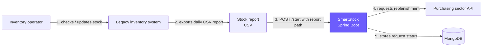
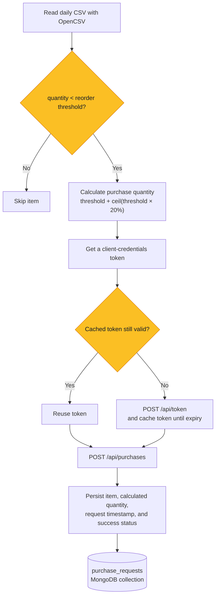
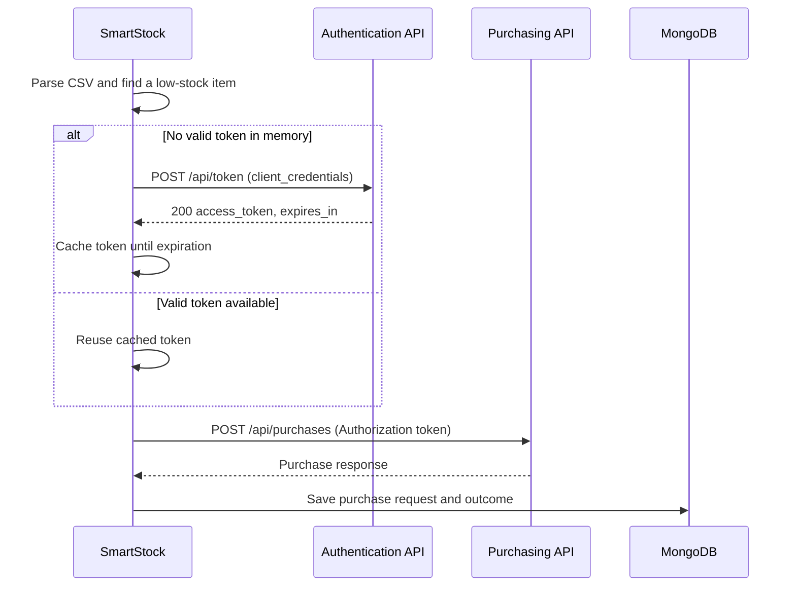

# SmartStock

> An asynchronous inventory replenishment service that turns a daily stock report into traceable purchase requests.

SmartStock bridges a legacy inventory workflow and a purchasing department API. It reads a CSV stock snapshot, identifies items below their reorder threshold, submits replenishment requests with authenticated API calls, and records the outcome in MongoDB. The project was built as a backend engineering portfolio piece, with emphasis on integration design, business rules, and a reproducible local development environment.

## Tech stack

| Area | Technology |
| --- | --- |
| Language & framework | Java 21, Spring Boot 4 |
| Persistence | MongoDB, Spring Data MongoDB |
| HTTP integration | Spring Cloud OpenFeign |
| CSV processing | OpenCSV |
| Local infrastructure | Docker Compose, Mockoon |
| API testing | Bruno collection |

## Architecture and workflow



### Replenishment decision



### Purchasing API interaction



## Business rules

- The input is a daily CSV report containing `item_id`, `item_name`, `quantity`, `reorder_threshold`, `supplier_name`, `supplier_email`, and `last_stock_update_time`.
- An item is eligible for replenishment only when its current quantity is below its reorder threshold.
- The purchase quantity is the reorder threshold plus a 20% safety margin, rounded up.
- The purchasing integration uses OAuth-style client credentials and reuses the in-memory token until it expires.
- Every replenishment attempt is recorded in MongoDB, including stock data, supplier data, calculated quantity, timestamp, and whether the request was successful.

## Run locally

### Prerequisites

- Java 21
- Docker and Docker Compose
- [Mockoon](https://mockoon.com/) (desktop app or CLI) to run the mock purchasing API
- Optional: [Bruno](https://www.usebruno.com/) to run the included HTTP requests

### 1. Start MongoDB

From the repository root:

```bash
docker compose -f docker/docker-compose.yml up -d
```

MongoDB will be available on `localhost:27017`. The development credentials and connection URI are already configured in `src/main/resources/application.properties`.

### 2. Start the purchasing API mock

Open `mockoon-api/purchase-sector-api.json` in Mockoon and start the environment. It is configured to listen on `http://localhost:3001` and exposes:

| Method | Endpoint | Purpose |
| --- | --- | --- |
| `POST` | `/api/token` | Returns an access token for valid client credentials |
| `POST` | `/api/purchases` | Receives a replenishment request |

The application defaults to the same API address and uses the mock credentials below. Override them with environment variables if needed.

```bash
export APP_CLIENT_ID=ABC
export APP_CLIENT_SECRET=DEF
```

### 3. Start SmartStock

```bash
./mvnw spring-boot:run
```

The service starts on `http://localhost:8080`.

### 4. Trigger a replenishment run

Use the included sample report, replacing the path with the absolute path on your machine:

```bash
curl -i -X POST http://localhost:8080/start \
  -H 'Content-Type: application/json' \
  -d '{"reportPath":"/absolute/path/to/smartstock/reports/stock.csv"}'
```

The endpoint returns `202 Accepted` because processing runs asynchronously. Low-stock items will be sent to the Mockoon API and saved in the `purchase_requests` collection in MongoDB.


## API reference

### `POST /start`

Starts asynchronous processing of a stock CSV report.

```json
{
  "reportPath": "/absolute/path/to/smartstock/reports/stock.csv"
}
```

Response: `202 Accepted`

## Test assets

- [`reports/stock.csv`](reports/stock.csv) provides a ready-to-run inventory report.
- [`mockoon-api/purchase-sector-api.json`](mockoon-api/purchase-sector-api.json) provides realistic authentication and purchasing API mocks, including validation and authorization scenarios.
- [`http-collection/SmartStock`](http-collection/SmartStock) is a Bruno collection with requests for starting SmartStock and exercising the mock endpoints. Import this folder in Bruno, then update the `reportPath` in the **Start** request to your local absolute path.

## Engineering highlights

- Designed a clean integration boundary with OpenFeign clients for authentication and purchasing services.
- Applied token caching and expiry checks to avoid unnecessary authentication calls during batch processing.
- Modeled a traceable purchase-request document with Spring Data MongoDB.
- Used OpenCSV bean mapping to transform a legacy flat-file report into typed domain data.
- Made external integration testing repeatable through a stateful Mockoon project and a Bruno request collection.

## Project structure

```text
src/main/java/com/thiago/smartstock/
├── client/          # OpenFeign API clients and transport DTOs
├── controller/      # HTTP entry point
├── domain/          # CSV input model
├── entity/          # MongoDB document
├── repository/      # Spring Data repository
└── service/         # CSV, authentication, purchasing, and orchestration logic
docker/              # MongoDB Docker Compose definition
mockoon-api/         # Purchasing API mock environment
http-collection/     # Bruno API test collection
reports/             # Sample CSV input
```


